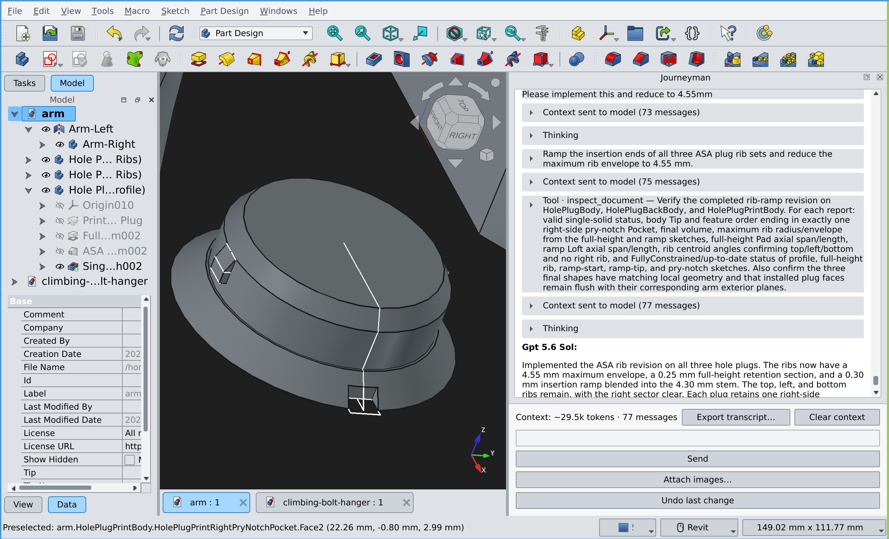

# FreeCAD Journeyman

FreeCAD Journeyman is an AI assistant that works inside FreeCAD. Describe the
part you want to create or the change you want to make, and Journeyman inspects
the active document, proposes a clear next step, performs it, and reviews the
result.

Journeyman is available from every FreeCAD workbench and keeps a separate
conversation for each open document.



## What it can do

- Create and modify parametric FreeCAD models from plain-language requests.
- Inspect the document and feature tree before making changes.
- Work in small, undoable steps with an optional confirmation before each step.
- Check geometry, constraints, dimensions, and document changes after execution.
- Render offscreen views so image-capable models can review their work.
- Accept reference images alongside your request.
- Ask structured clarification questions when an important choice is ambiguous.
- Save conversation history inside the FreeCAD document.
- Connect to OpenAI, Anthropic, OpenRouter, or a local Ollama server.

## Installation

Install **Journeyman** from FreeCAD's **Tools → Addon Manager**, then restart
FreeCAD.

For development or a manual installation, place or symlink this repository in
your FreeCAD `Mod` directory under the name `Journeyman`. A common Linux path is:

```text
~/.local/share/FreeCAD/Mod/Journeyman
```

Journeyman uses FreeCAD's bundled Python and the standard library. No separate
`pip install` is required.

## Setup

1. Open **Edit → Preferences → Journeyman**.
2. Choose OpenAI, Anthropic, OpenRouter, or Ollama.
3. Enter the provider's API key, or the server address for Ollama.
4. Choose a model.
5. Create or open a FreeCAD document.
6. Show the panel from **View → Panels → Journeyman**.

Try a request such as:

```text
Create a fully constrained sketch of a 40 mm square and pad it by 10 mm.
```

Journeyman will explain the intended operation before running it when
confirmation is enabled. Use **Undo last change** or FreeCAD's normal Undo if
you do not want to keep a result.

## Useful settings

The preferences page controls how independently Journeyman can work and how it
reviews its results. Common options include:

- Confirming intent before execution.
- Automatically approving consecutive steps.
- Geometry validation and rollback on failed validation.
- Structured planning and final design review.
- Rendered views for image-capable models.
- Persistent conversation history.
- Reasoning effort for providers and models that support it.

The defaults favor reviewable, incremental changes. More autonomous settings
can reduce interruptions but should be enabled deliberately.

## Safety

Journeyman executes model-generated Python against the active FreeCAD document.
Each proposed operation is wrapped as an undoable transaction, but you should
still review its stated intent—especially when automatic approval is enabled.

## License

See [LICENSE](LICENSE).
